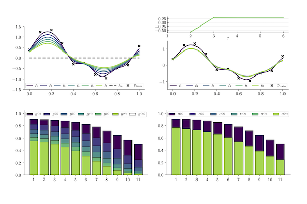

<!--  -->

> This page is under development...

## About
1

## Research
2

## Publications
<table class="smaller">
<tbody>
  <tr>
    <td rowspan="3" width=40%></td>
    <td width=60%><a href="https://https://arxiv.org/abs/2102.13088" target="_blank"><b>Even Your Teacher Needs Guidance: Ground-Truth Targets Dampen Regularization Imposed by Self-Distillation</b></a></td>
  </tr>
  <tr>
    <td width=60%><b>Kenneth Borup</b>, Lars N. Andersen <i>NeurIPS 2021</i></td>
  </tr>
  <tr>
    <td width=60%>Paper&emsp;<a href="https://https://arxiv.org/abs/2102.13088" target="_blank">arXiv</a>&emsp;Code</td>
  </tr>
</tbody>
</table>

## Contact
4
